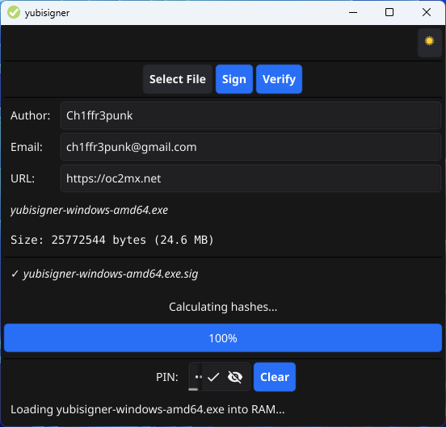
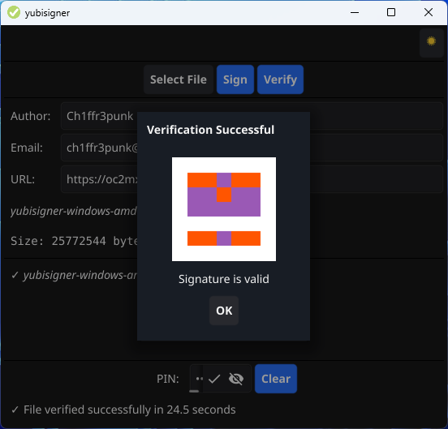

# yubisigner

Hardware-based, multi-standard file signing with YubiKey  
yubisign is a compact GUI program for signing and verifying  
files with YubiKey. It supports international cryptographic  
standards and offers maximum security through hardware keys.  

## Features

YubiKey hardware security  

- 4 hash algorithms: RIPEMD-256, SHA-256, SM3 and Streebog-256  
- RFC-compliant signatures with CRLF  
- Compact GUI with dark/light mode  
- Identicon for author verification (see [yubicrypt](https://github.com/Ch1ffr3punk/yubicrypt))  
- UTF-8 support for international characters in author string  
  of detached .sig file  



  

If you like yubisigner, as much as I do,  consider a small          
donation in crypto currencies or buy me a coffee.           
```  
BTC: bc1qkluy2kj8ay64jjsk0wrfynp8gvjwet9926rdel       
Nym: n1f0r6zzu5hgh4rprk2v2gqcyr0f5fr84zv69d3x       
XMR: 45TJx8ZHngM4GuNfYxRw7R7vRyFgfMVp862JqycMrPmyfTfJAYcQGEzT27wL1z5RG1b5XfRPJk97KeZr1svK8qES2z1uZrS        
```
<a href="https://www.buymeacoffee.com/Ch1ffr3punk" target="_blank"></a>

yubisigner is dedicated to Alice and Bob.  
